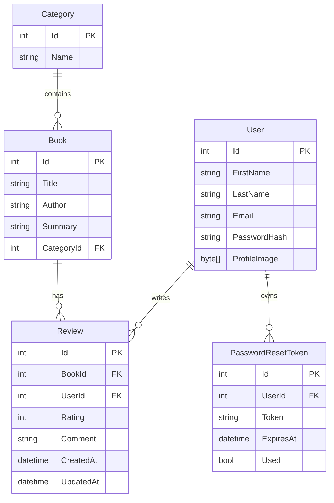
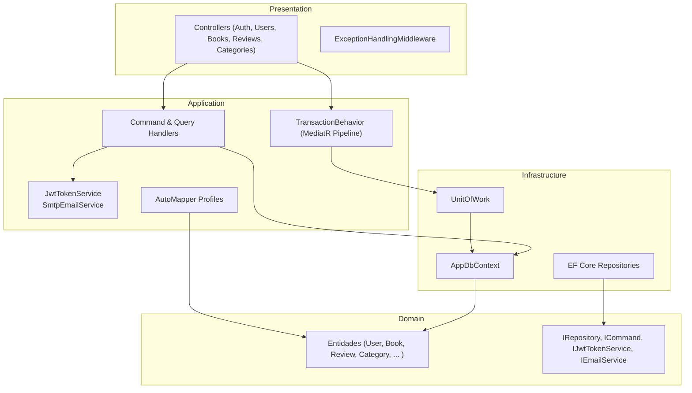
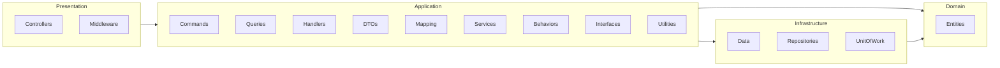

# Book_Reviews

Este repositorio contiene dos proyectos:

1. **API (Book Reviews)** – ASP .NET Core 8 con Clean Architecture.  
2. **Frontend (Next.js + TypeScript)** – consume la API.

---

## Diagramas

### Diagrama de datos



### Diagrama de componentes



### Diagrama de paquetes



---

## Backend – Book Reviews API

### Prerrequisitos

- [.NET 8 SDK](https://dotnet.microsoft.com/download)  
- MySQL 8+ en `localhost:3306` (o ajustar en appsettings)

### Configuración

1. Copiar `Presentation/appsettings.json` → `Presentation/appsettings.Development.json` y ajustar:
   ```jsonc
   {
     "ConnectionStrings": {
       "MySql": "Server=localhost;Port=3306;Database=book_reviews;Uid=root;Pwd=root;"
     },
     "JwtSettings": {
       "SecretKey": "<tu_clave>",
       "Issuer": "<tu_issuer>",
       "Audience": "<tu_audience>",
       "AccessTokenExpirationMinutes": 60,
       "RefreshTokenExpirationDays": 7
     },
     "Smtp": {
       "Host": "smtp.sendgrid.net",
       "Port": 465,
       "UseSsl": true,
       "User": "apikey",
       "Password": "<tu_api_key>",
       "From": "tu@correo.com"
     }
   }
   ```

### Ejecutar localmente

```bash
git clone https://github.com/Cristian-Infante/Book_reviews
cd "Book Reviews"

# reconstruir y ejecutar API
dotnet restore
dotnet build
dotnet run --project Presentation/Presentation.csproj
```

Accede a **https://localhost:7074/swagger** para probar endpoints.

### Despliegue con Docker Compose

1. Crear `compose.yaml` en raíz:
   ```yaml
   version: '3.8'
   services:
     db:
       image: mysql:8
       environment:
         MYSQL_ROOT_PASSWORD: root
         MYSQL_DATABASE: book_reviews
       ports: ['3306:3306']
     api:
       build:
         context: .
         dockerfile: Presentation/Dockerfile
       depends_on: ['db']
       environment:
         ConnectionStrings__MySql: "Server=db;Port=3306;Database=book_reviews;Uid=root;Pwd=root;"
         JwtSettings__SecretKey:    "<tu_clave>"
         JwtSettings__Issuer:       "<tu_issuer>"
         JwtSettings__Audience:     "<tu_audience>"
         Smtp__Host:                "smtp.sendgrid.net"
         Smtp__Port:                "465"
         Smtp__UseSsl:              "true"
         Smtp__User:                "apikey"
         Smtp__Password:            "<tu_api_key>"
         Smtp__From:                "tu@correo.com"
       ports: ['5219:5219']
   ```
2. Levantar:
   ```bash
   docker-compose up -d
   ```

## 🖥️ Frontend – Next.js + TypeScript

### Prerrequisitos

- [Node.js 18+](https://nodejs.org/)  
- npm o Yarn

### Configuración

1. Crear `.env.local` en carpeta del frontend:
   ```ini
   NEXT_PUBLIC_API_URL=http://localhost:5219/api
   ```
2. Ajustar si cambia el puerto o dominio de la API.

### Ejecutar localmente

```bash
cd book_reviews_front
npm install
npm run dev
```

Abre **http://localhost:3000** en tu navegador.

### Despliegue en Vercel

1. Conecta tu repo en Vercel.  
2. Define en **Settings → Environment Variables**:
   ```
   NEXT_PUBLIC_API_URL = https://<tu-dominio>/api
   ```
3. Build & Deploy (Vercel detecta Next.js automáticamente).