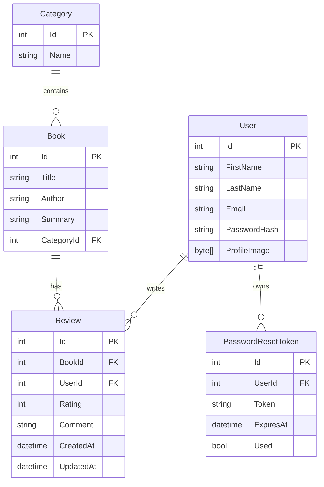
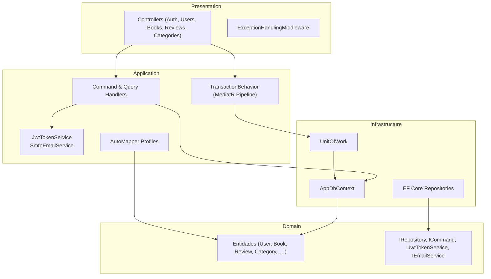
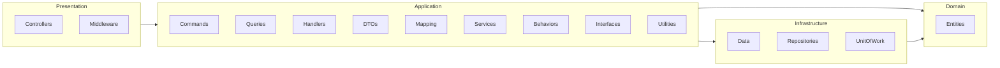

# Book_reviews

## Diagrama de datos

```mermaid
erDiagram
    User {
        int Id PK
        string FirstName
        string LastName
        string Email
        string PasswordHash
        byte[] ProfileImage
    }
    Category {
        int Id PK
        string Name
    }
    Book {
        int Id PK
        string Title
        string Author
        string Summary
        int CategoryId FK
    }
    Review {
        int Id PK
        int BookId FK
        int UserId FK
        int Rating
        string Comment
        datetime CreatedAt
        datetime UpdatedAt
    }
    PasswordResetToken {
        int Id PK
        int UserId FK
        string Token
        datetime ExpiresAt
        bool Used
    }

    User ||--o{ Review                : writes
    Book ||--o{ Review                : has
    Category ||--o{ Book              : contains
    User ||--o{ PasswordResetToken    : owns
```

## Diagrama de componentes

```mermaid
graph TB
  subgraph Presentación [Presentation]
    API["Controllers (Auth, Users, Books, Reviews, Categories)"]
    Middleware["ExceptionHandlingMiddleware"]
  end
  subgraph Aplicación [Application]
    Pipeline["TransactionBehavior (MediatR Pipeline)"]
    Handlers["Command & Query Handlers"]
    Servicios["JwtTokenService<br/>SmtpEmailService"]
    Mapeo["AutoMapper Profiles"]
  end
  subgraph Dominio [Domain]
    Entidades["Entidades (User, Book, Review, Category, ... )"]
    Interfaces["IRepository, ICommand, IJwtTokenService, IEmailService"]
  end
  subgraph Infraestructura [Infrastructure]
    Contexto["AppDbContext"]
    Repositorios["EF Core Repositories"]
    UoW["UnitOfWork"]
  end

  API --> Pipeline
  API --> Handlers
  Pipeline --> UoW
  Handlers --> Servicios
  Handlers --> Contexto
  Contexto --> Entidades
  Repositorios --> Interfaces
  UoW --> Contexto
  Mapeo --> Entidades
```

## Diagrama de paquetes

```mermaid
graph LR
  subgraph Presentation
    Controllers
    Middleware
  end
  subgraph Application
    Commands
    Queries
    Handlers
    DTOs
    Mapping
    Services
    Behaviors
    Interfaces
    Utilities
  end
  subgraph Domain
    Entities
    Interfaces
  end
  subgraph Infrastructure
    Data
    Repositories
    UnitOfWork
  end

  Presentation --> Application
  Application --> Domain
  Application --> Infrastructure
  Infrastructure --> Domain

```
