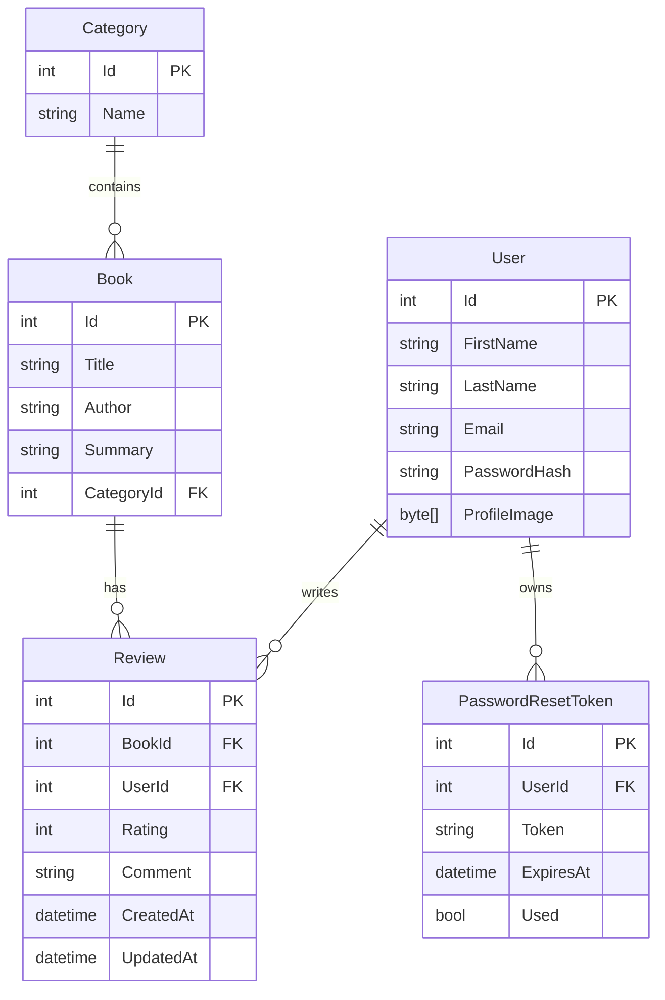

# Book_reviews

```mermaid
erDiagram
    User {
        int Id PK
        string FirstName
        string LastName
        string Email
        string PasswordHash
        byte[] ProfileImage
    }
    Category {
        int Id PK
        string Name
    }
    Book {
        int Id PK
        string Title
        string Author
        string Summary
        int CategoryId FK
    }
    Review {
        int Id PK
        int BookId FK
        int UserId FK
        int Rating
        string Comment
        datetime CreatedAt
        datetime UpdatedAt
    }
    PasswordResetToken {
        int Id PK
        int UserId FK
        string Token
        datetime ExpiresAt
        bool Used
    }

    User ||--o{ Review                : writes
    Book ||--o{ Review                : has
    Category ||--o{ Book              : contains
    User ||--o{ PasswordResetToken    : owns
```
